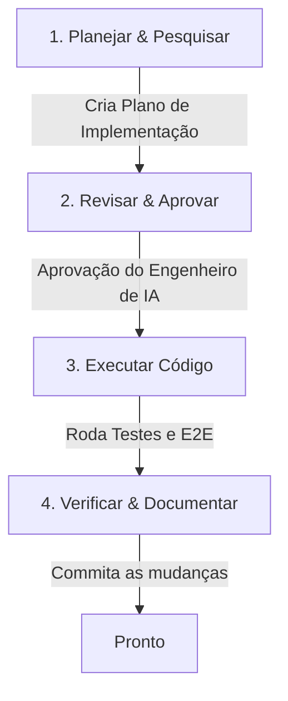

# 🤖 Guia Prático de Engenharia de IA - RuivoBarber

Este guia foi elaborado para orientar você (**Mark**, **Rodrigo** e **Igor**) a atuar como **Engenheiro de IA** utilizando o agente **Antigravity**. 

Aqui, focamos no conceito de **Orquestração de Agentes "Zero Code"**, onde o Engenheiro humano atua na tomada de decisões, arquitetura e validação, enquanto a IA executa e depura o código sob demanda.

---

## 🧭 1. O Papel do Engenheiro de IA
Como Engenheiro de IA, você não digita código-fonte. Suas responsabilidades são:
1.  **Definir Objetivos Claros**: Traduzir regras de negócios complexas em metas claras para o agente de IA.
2.  **Desenhar a Arquitetura**: Garantir que a IA respeite as diretrizes estabelecidas (como *Ports & Adapters* em Go e isolamento de regras em *Hooks/Services* no React).
3.  **Aprovar Planos**: Analisar criticamente os planos técnicos que a IA propõe antes de dar o aval para a escrita de código.
4.  **Validar Resultados**: Rodar e avaliar suítes de testes automatizados e simulações E2E.

---

## 📈 2. Gerenciamento de Janela de Contexto e Tokens
IAs baseadas em LLM funcionam com base em tokens (pedaços de palavras). Compreender este fluxo é crucial para evitar lentidão e custos desnecessários:

### Janela de Contexto
Tudo o que é enviado na conversa (código lido, mensagens anteriores, logs de comandos) preenche a **Janela de Contexto** do agente.
*   **Compactação Automática**: Quando o contexto do Antigravity fica muito grande, o sistema realiza uma compactação (resumo). Isso limpa o histórico de chat detalhado, mas mantém os artefatos (`task.md`, `walkthrough.md` e `implementation_plan.md`) intactos.
*   **Boas Práticas de Economia de Tokens**:
    *   Evite ler arquivos gigantescos de uma vez se puder usar busca focada (`grep_search`).
    *   Mantenha discussões paralelas curtas. Se o objetivo mudar drasticamente, resuma o estado atual e inicie uma nova etapa.

---

## ⚡ 3. Limites de Taxa da API (Rate Limits)
As APIs de LLM do Google possuem limites estritos para garantir estabilidade:
*   **RPM (Requests Per Minute)**: Limite de chamadas que podem ser feitas por minuto.
*   **TPM (Tokens Per Minute)**: Limite de tokens (dados enviados e recebidos) por minuto.

### Como lidar com erros HTTP 429 (Too Many Requests)?
Se o agente de IA ou suas integrações receberem o erro HTTP 429, significa que o limite foi atingido. As diretrizes do projeto ditam:
1.  **Exponential Backoff (Espera Exponencial)**: Pause a execução do agente por um tempo progressivamente maior (ex: 15s, depois 30s) antes de tentar novamente.
2.  **Sequencialização**: Priorize operações sequenciais em vez de spawnar múltiplos sub-agentes paralelos que consomem a cota de TPM muito rápido.

---

## 🔄 4. O Fluxo de Trabalho do Agente (Plan-Approve-Execute-Verify)
Ao trabalhar com o Antigravity, o ciclo ideal de engenharia de IA segue 4 passos:

1.  **Planejar (Research & Plan)**: O agente pesquisa os arquivos, entende a arquitetura e escreve um plano de implementação.
2.  **Revisar (Approve)**: Você avalia as dependências, se o plano segue o padrão de arquitetura e aprova ou solicita alterações.
3.  **Executar (Execute)**: O agente escreve o código e executa os testes automáticos locais (`./scripts/*.sh`).
4.  **Verificar (Verify & Walkthrough)**: O agente cria um passo a passo do que foi alterado e o Engenheiro de IA realiza a homologação final.
