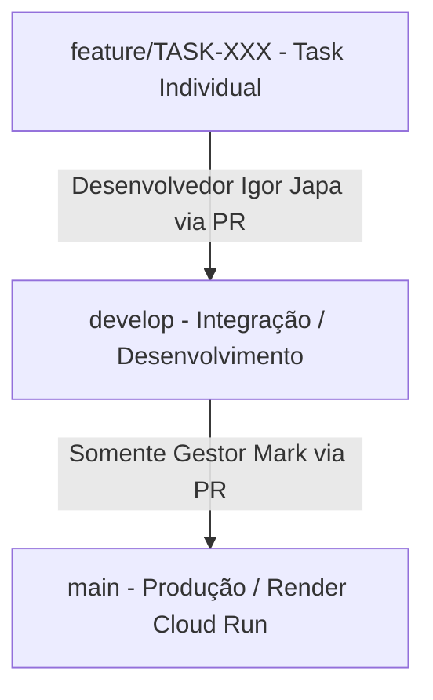

# 🛡️ GLI — Guia de Linha de Integração (Fluxo de Git RuivoBarber)

Este guia define as regras de desenvolvimento, papéis no repositório e isolamento de ambientes para evitar sobrecarga e deploys indesejados no Render (produção).

---

### 🎯 0. Regras de Engenharia e Execução
A arquitetura do RuivoBarber está madura e delineada no `TASKS.md`. A partir deste momento crítico pré-lançamento comercial, aplicamos a seguinte disciplina tática:
1. Planejamentos e diagramas são insumos, não entregáveis finais.
2. Só existe progresso real aprovado quando houver:
   - Código implementado fisicamente.
   - Código compilando sem erros no Go/React.
   - Código validado por testes contra as regras de negócio.
   - Código commitado e rastreado no GitHub.
A execução do dia a dia ocorre sempre vinculada à Issue ativa (atualmente a Issue #66).

---

## 👥 1. Papéis e Responsabilidades

*   **Gestor do Projeto (Owner)**: **Mark** (`yuremarketing`).
    *   Único responsável pela administração geral do repositório.
    *   Aprova e realiza merges na branch `main` para promover alterações para a produção.
*   **Desenvolvedor**: **Igor Japa**.
    *   Responsável pelo desenvolvimento de novas funcionalidades e correções de bugs.
    *   Atua exclusivamente nas branches temporárias e faz a integração na branch `develop`.

---

## 🌿 2. Estrutura de Branches e Isolamento



### A. Branch `main` (Produção)
*   **Destino**: Conectada diretamente ao pipeline de deploy no **Render / Google Cloud Run** (ambiente de produção).
*   **Regra de Ouro**: **PROIBIDO push direto ou merge automático** (bloqueado por regras do GitHub). Apenas o Gestor (Mark) pode mergear Pull Requests vindos de `develop` para `main` após homologação.

### B. Branch `develop` (Desenvolvimento)
*   **Destino**: Ambiente compartilhado de desenvolvimento e integração local/testes.
*   **Regra de Ouro**: **PROIBIDO push direto**. Toda alteração deve ser enviada para uma branch de feature e integrada via Pull Request no GitHub.

### C. Branches de Funcionalidades (`feature/TASK-XXX-nome`)
*   Criadas sempre a partir de `develop`.
*   Usadas para o isolamento de cada tarefa do roadmap local.

---

## 🔄 3. Ciclo de Trabalho Diário (Igor Japa)

Para iniciar e concluir qualquer tarefa, siga este fluxo rígido no terminal:

1.  **Sincronizar a base local**:
    ```bash
    git checkout develop
    git pull origin develop
    ```
2.  **Criar branch de desenvolvimento específica**:
    ```bash
    git checkout -b feature/TASK-XXX-nome-da-tarefa
    ```
3.  **Desenvolver e registrar**:
    *   Codificar a funcionalidade.
    *   Criar o arquivo de log local em `.antigravity/logs/log-task-XXX.md` detalhando as alterações.
    *   Marcar a tarefa como concluída no Kanban local (`.antigravity/kanban/done.md`).
4.  **Commitar e subir para o GitHub**:
    ```bash
    git add .
    git commit -m "feat: [TASK-XXX] descricao da funcionalidade"
    git push -u origin feature/TASK-XXX-nome-da-tarefa
    ```
5.  **Abrir Pull Request (PR)**:
    *   Abrir PR na UI do GitHub apontando a branch da task **para `develop`** (nunca para `main`).
